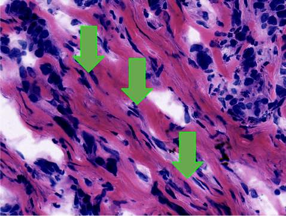
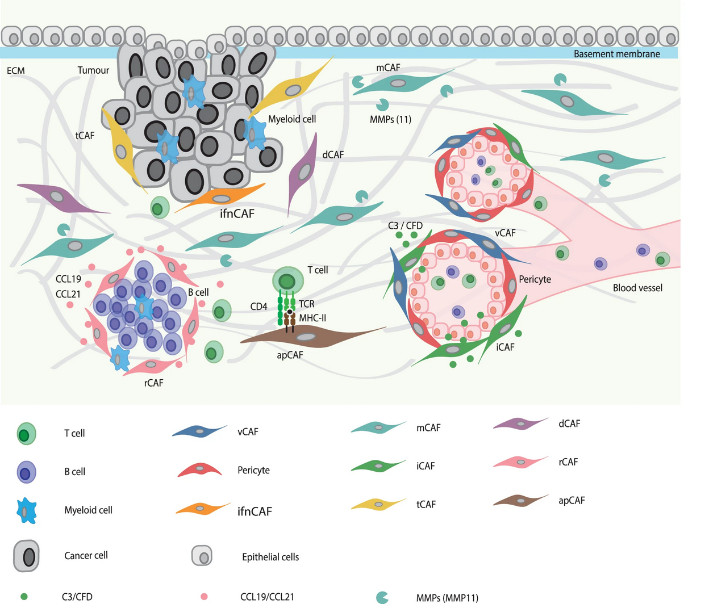
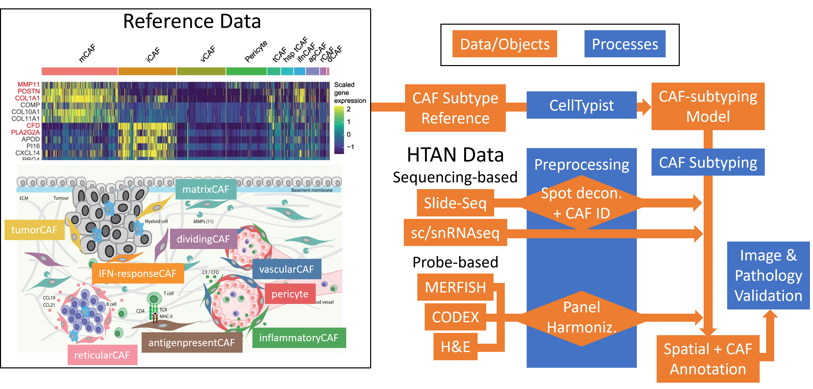

# Validation-of-CAF-Subtypes
<b>Team Leader</b>: Jenny Chien  
<b>Tech Leader</b>: Canping Chen  
<b>Writer</b>: Alex Xu  
<b>Team</b>: Alice Browne, Brian Mott, Filippo Pederzoli, Jing Zhu, Nathan Wong
## What are CAFs
Cancer-associated fibroblasts are a diverse set of stromal cells populating the tumor microenvironment (TME), easily recognized by a spindle-like nuclear and membrane structure.
 

 
They are widely responsible for shaping the extracellular matrix and the physico-chemical properties of the tumor, and executing pro- and anti-tumor functions by secreting proteases, cytokines, and growth factors that promote tumor growth, suppress immunity, and more. CAFs receive a fraction of the attention given to immune cells, where heterogeneity is resolved by lymphoid/myeloid lineage and further by immune cell subtypes and exhaustion state. In contrast, CAFs have been defined as a monolith, expressing markers such as alpha-SMA or vimentin. More recently, CAF heterogeneity of clinical significance has been discovered, via signaling such as podoplanin linked to poor outcomes. In 2023, deep single cell sequencing of fibroblast populations defined across 9 subtypes, including matrix CAFs, inflammatory CAFs, vascular CAFs, and others.
 
<!---->
 
We hypothesize that mapping CAF heterogeneity onto single cell and spatial omics data will better resolve patient and sample heterogeneity stemming from these previously-neglected CAFs. Further, by defining CAF subtypes, we can propose distinctive markers of CAF subtypes and propagate CAF subtypes to other forms of spatial data that lack the molecular resolution of scRNAseq, allowing CAF subtypes to be defined in datasets such as spatial protein (e.g. IMC, CODEX, etc) and probe-based spatial RNA (e.g. MERFISH, CosMx) assays.

## Objectiveimageshttps://cellxgene.cziscience.com/collections/bd552f76-1f1b-43a3-b9ee-0aace57e90d6s
We will develop computational methods to annotate CAF subtypes across a range of spatial omic assays available in HTAN.
If successful, users will be able to:
1. Train and validate a CellTypist model to identify CAF subtypes.
2. Identify CAF subtypes in scRNAseq datasets
3. Apply CAF subtyping to spatial transcriptomic data
4. Identify CAF subtype signatures in spatial protein and imaging data
5. Apply CAF subtyping in other spatial assays

## Strategy
### Requirements

### Preparation
To achieve our goal of generalized CAF subphenotyping of spatial omics data, we first generate a subtyping model with CellTypist using 10-fold validation of the CAF scRNAseq reference data set from Cords 2023.
INSERT CODE BLOCKS AND QUALITY METRICS
 
Next we apply sample preprocessing to spatial omic modalities to prepare for subtyping.
 
<b>Input formats: scRNAseq, snRNAseq, SlideSeq, MERFISH, CODEX, MIBI
</b>
 
Data input/output can be performed packages like XYZ.
 

 
The primary constraint is the information depth and resolution of the spatial omic input data. We apply our strategy first to the data of Klughammer et al, a recent multi-omic study of breast cancer.
 

 
### Oversampled Input Data
Sequencing-based spatial omics generates low density, high coverage molecular profiles that often lack true single cell resolution. We used RCTD to approximate single CAF data points and applied the CAF subtyping model.

INSERT CODE BLOCKS AND QUALITY METRICS

In this preliminary dataset, we find STUFF.

OVERLAY IMAGES

Validation is performed by projecting CAF subtyping results against corresponding H&E, and quantifying patient- and tissue-specific CAF proportions.

OVERLAY CAF RESULTS ONTO H&E

### Understampled Input Data
Probe-based spatial omics use sparse probe sets that rarely coincide with markers of CAF subtypes. Preprocessing results in relatively well-defined cells via segmentation, but projecting CAF phenotypes onto the dataset may require a bespoke process depending on format.
 
We attempted to preprocess MERFISH, CODEX, and H&E images to correlate with transcriptomically-defined CAF subtypes.
 
MERFISH: ~300 genes, focused on tumor and immune genes of interest (10 gene final overlap with CAF subtype DEG XXXXX)
 
CODEX: 50 proteins, focused on tumor and immune markers (3 gene final overlap with CAF subtype DEG XXXXX)
 
H&E: 2 color, baso/acidophilic staining
 
We developed a conceptual pipeline for pipeline harmonization, where reference data and sample data must align.
1. Reference data depth
  - Full scRNA CAF subtype
  - CAF subtype DEGs
  - CAF subtype protein
2. Target data format
  - Spatial or single cell
  - RNA or protein
3. Target data depth
  - Full transcriptome
  - Probe set
  - Targeted proteins
 

 
Tools for bridging spatial and single cell: RCTD, STdeconvolve
 
Tools for bridging full transcriptome to targeted probes:
1. Exact match
2. Shared pathways
3. Functional annotated relationships
### Existing Issues
- For understampled data, confidence in assigned CAF subtypes is very low
- CAF subtypes are not morphologically distinct and cannot be distinguished by most protein panels, so cannot be validated with non-RNA data
- Rare cell types are lost during harmonization steps, and low cell numbers can result in math and processing errors
## Next Steps
Generalizability of CAF reference data: Are 9 CAF subtypes specific to breast cancer or are they identifiable in other tissues? 
True multi-omic vs. adjacent slides: Can we expect alignment between slides, to validate CAF subtyping between modalities in the "same" tissue? 
Scope of CAF subtyping: Can we subtype at broad and coarse scales simultaneously, or do we need to identify fibroblasts first before subtyping separately? 

### References
[CAF Subtypes](https://www.nature.com/articles/s41467-023-39762-1)
[Training Data](https://www.nature.com/articles/s41591-024-03215-z)

Point out which data to use
Add text bullet workflow
Which tools used
INCLUDE STEPS AND WHICH DATA WAS USED STEP BY STEP
LIST TEAM MEMBERS
EXPLAIN RESULTS OF OUTPUTS, WHERE IT CAME FROM, BE EXPLICIT
LIST PLANNED FEATURES AND FUTURE IDEAS
DEFINE YOUR JARGON
LIST THE PROBLEMS
Training data specificity (breast cancer)
Relevant for metastatic sample in test data?

RCTD on SLIDESEQ

