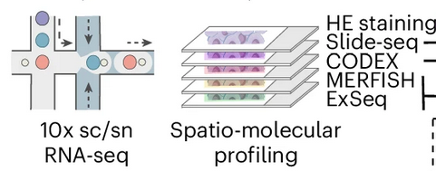

# Validation-of-CAF-Subtypes
<b>Team Leader</b>: Jenny Chien  
<b>Tech Leader</b>: Canping Chen  
<b>Writer</b>: Alex Xu  
<b>Team</b>: Alice Browne, Brian Mott, Filippo Pederzoli, Jing Zhu, Nathan Wong
## What are CAFs
Cancer-associated fibroblasts are a diverse set of stromal cells populating the tumor microenvironment (TME), easily recognized by a spindle-like nuclear and membrane structure.
 

 
They are widely responsible for shaping the extracellular matrix and the physico-chemical properties of the tumor, and executing pro- and anti-tumor functions by secreting proteases, cytokines, and growth factors that promote tumor growth, suppress immunity, and more. CAFs receive a fraction of the attention given to immune cells, where heterogeneity is resolved by lymphoid/myeloid lineage and further by immune cell subtypes and exhaustion state. In contrast, CAFs have been defined as a monolith, expressing markers such as alpha-SMA or vimentin. More recently, CAF heterogeneity of clinical significance has been discovered, via signaling such as podoplanin linked to poor outcomes. In 2023, deep single cell sequencing of fibroblast populations defined 9 subtypes, including matrix CAFs, inflammatory CAFs, vascular CAFs, and others.
  
We hypothesize that mapping CAF heterogeneity onto single cell and spatial omics data will better resolve patient and sample heterogeneity stemming from CAFs. Further, by defining CAF subtypes, we can propose distinctive markers of CAF subtypes and propagate CAF subtypes to other forms of spatial data that lack the molecular resolution of scRNAseq, allowing CAF subtypes to be defined in datasets such as spatial protein (e.g. IMC, CODEX, etc) and probe-based spatial RNA (e.g. MERFISH, CosMx) assays.

## Objective
We will develop computational methods to annotate CAF subtypes across a range of spatial omic assays available in HTAN.
If successful, users will be able to:
1. Train and validate a prediction model to identify CAF subtypes
2. Identify CAF subtypes in scRNAseq datasets
3. Apply CAF subtyping to spatial transcriptomic data
4. Identify CAF subtype signatures in spatial protein and imaging data
5. Apply CAF subtyping in other spatial assays
6. Confirm the location of CAF subtypes by comparing to imaging data
### Requirements
:boom:INSERT PACKAGES AND VERSION NUMBERS HERE
- Python
  - scanpy - 1.10.1
  - anndata - 0.10.7
- R
  - Seurat - 5.0.2
  - anndata - 0.7.5.6
  - reticulate - 1.39.0
  - ggplot2 - 3.5.1
  - data.table - 1.16.2
### Data
[CAF Subtype](https://zenodo.org/records/7540604)
 
[HTAN Multi-omic](https://data.humantumoratlas.org/publications/hta1_2024_pdf_johanna-klughammer)
 
[HTAN Multi-omic CellxGene](https://cellxgene.cziscience.com/collections/bd552f76-1f1b-43a3-b9ee-0aace57e90d6s)
### Pipeline :boom:INCLUDING PACKAGE NAMES AND SPECIFIC PIPELINES/TECHNIQUES USED
1. CellTypist: create model using CAF subtype reference data
   -. Use CAF reference data
3. sklearn: train model via 10-fold validation
4. Preprocess data
   - Use multi-omic data
   - RCTD: attribute spatial data to CAF type
   - :boom:WHAT ARE ALL THE PACKAGES WE USED AND WHEN
   -
6. Xena viewer: validate CAF subtyping via multi-omics
 

## Strategy
### Preparation
To achieve our goal of generalized CAF subphenotyping of spatial omics data, we first generate a subtyping model with CellTypist using 10-fold validation of the CAF scRNAseq reference data set from Cords 2023.
 
:boom:INSERT CODE BLOCKS AND QUALITY METRICS, CONFIDENCE VS #GENES USED
 
Next we apply sample preprocessing to spatial omic modalities to prepare for subtyping.
 
<b>Input formats: scRNAseq, snRNAseq, SlideSeq, MERFISH, CODEX, MIBI
</b>
 
Data input/output can be performed packages like XYZ.
 
The primary constraint is the information depth and resolution of the spatial omic input data. We apply our strategy first to the data of Klughammer et al, a recent multi-omic study of breast cancer.
 

 
### Oversampled Input Data
Sequencing-based spatial omics generates low density, high coverage molecular profiles that often lack true single cell resolution. We used RCTD to approximate single CAF data points and applied the CAF subtyping model.
#### scRNAseq Validation
:boom:INSERT CODE BLOCKS FOR BASIC VALIDAtION OF SCRNASEQ CAF SUB TYPING
 
We find that CAF subtype proportions in Klughammer data match reference proportions. INSERT PLOT
 
:boom:We also find tissue type dependence???? INSERT PLOT
 
#### SlideSeq Test
:boom:INSERT CODE BLOCKS AND QUALITY METRICS
In this preliminary dataset, we find STUFF.
:boom:Show results of CAF subtyping (table, bar plot)
SHOW RESULTS PROJECtED ONTO SPATIAL COORDINATES
 
Validation is performed by projecting CAF subtyping results against corresponding H&E, and quantifying patient- and tissue-specific CAF proportions.
 
Use `VisualizeCAFSubtypes.R`
:boom:OVERLAY CAF RESULTS ONTO H&E
#### Existing Issues
- :boom: WHERE DID WE GET STUCK? SMALL THINGS GO HERE, BIG PICTURE STUFF GOES IN THE FUTURE DIRECTIONS SECTION BELOW
- Rare cell types are lost during harmonization steps, and low cell numbers can result in math and processing errors
### Understampled Input Data
CAF subtypes must be mapped onto the available probes
Probe-based spatial omics use sparse probe sets that rarely coincide with markers of CAF subtypes. Preprocessing results in relatively well-defined cells via segmentation, but projecting CAF phenotypes onto the dataset may require a bespoke process depending on format.
 
We attempted to preprocess MERFISH, CODEX, and H&E images to correlate with transcriptomically-defined CAF subtypes.
 
MERFISH: ~300 genes, focused on tumor and immune genes of interest (10 gene final overlap with CAF subtype DEG XXXXX)
 
CODEX: 50 proteins, focused on tumor and immune markers (3 gene final overlap with CAF subtype DEG XXXXX)
 
H&E: 2 color, baso/acidophilic staining
 
#### Considerations for undersampled data preprocessing
1. Reference data depth
  - Full scRNA CAF subtype
  - CAF subtype DEGs
  - CAF subtype protein
2. Target data format
  - Spatial or single cell
  - RNA or protein
3. Target data depth
  - Full transcriptome
  - Probe set
  - Targeted proteins
Construct a mapping between CAF signatures and available markers.
 
Tools for bridging spatial and single cell: RCTD, STdeconvolve
 
Tools for bridging full transcriptome to targeted probes:
1. Exact match
2. Shared pathways
3. Functional annotated relationships
   
#### MERFISH Test
We used the DEG table (Supplementary Table 3, CAF reference) and selected genes with :boom: adjusted-p<XXXX for a single CAF subtype, which we defined as as the gene signature for that subtype. Subtype signature scores were calculated as the mean expression of all genes in the signature.
 

 
We projected MERFISH CAF subtype scores onto H&E images usimg `htan_jamboree_merfish_binned.ipynb` or `merfish_not_binned.ipynb`, finding concordance with SlideSeq spatial projections. * - denotes genes used in the MERFISH gene signature.
 
:boom: ADD IMAGES OF H&E AND MERFISH PROJECTIONS

#### CODEX Test
Only 3 overlapping gene/protein pairs were found with CAF subtypes and the provided leiden clusters were poor, CAFs could not be easily identified.
 
CAF subtyping was unsuccessful. Authors provided  10-20 clusters on 50 proteins across all subtypes, some clusters were defined functionally (i.e. Ki67+), CAFs and immune cells were co-clustered. Remaining markers would not be able to resolve CAF subtypes either (only 3 exact matches, shared pathway analysis not performed).
 

 
Note: VIM+ clusters overlap with PTPRC(CD45)+ and other immune markers, or PECAM1(CD31)+ endothelial marker. KRT19 tumor marker is uniformly expressed. Additional preprocessing of CODEX phenotyping would be needed.
#### Existing Issues
- For understampled data, confidence in assigned CAF subtypes is lower, we can score CAF subtypes using MERFISH but we have not classified
- CAF subtypes are not morphologically distinct and cannot be distinguished by most protein panels, so assignments are difficult to validate with non-RNA data
## Final results
- [x] CAF subtype classifier
- [x] CAF classifier validation
- [x] SlideSeq preprocessing
- [x] SlideSeq: Classifier applied
- [x] SlideSeq: Images validated
- [X] MERFISH preprocessing
- [x] MERFISH: Score established
- [ ] MERFISH: CAFs classified 
- [ ] CODEX preprocessing
- [x] Image overlay protocol
## Next Steps
- Convert MERFISH CAF subtype gene signature scores to a classifier
- Re-analyze CODEX to obtain CAF populations or request from authors
### Future Directions
Generalizability of CAF reference data: Are 9 CAF subtypes specific to breast cancer or are they identifiable in other tissues?
 
True multi-omic vs. adjacent slides: Can we expect alignment between slides, to validate CAF subtyping between modalities in the "same" tissue?
 
Scope of CAF subtyping: Can we subtype at broad and coarse scales simultaneously, or do we need to identify fibroblasts first before subtyping separately?
 
### References
[CAF Subtypes](https://www.nature.com/articles/s41467-023-39762-1)
[Training Data](https://www.nature.com/articles/s41591-024-03215-z)

EXPLAIN RESULTS OF OUTPUTS, WHERE IT CAME FROM, BE EXPLICIT
LIST PLANNED FEATURES AND FUTURE IDEAS
DEFINE YOUR JARGON
